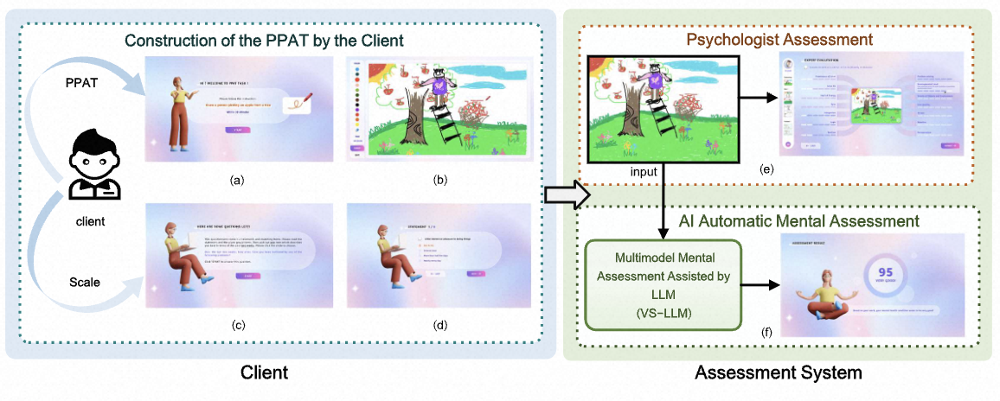
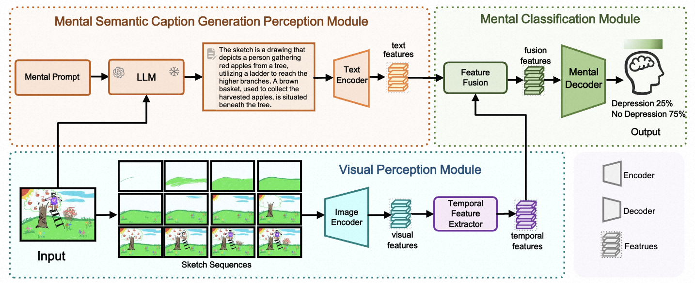
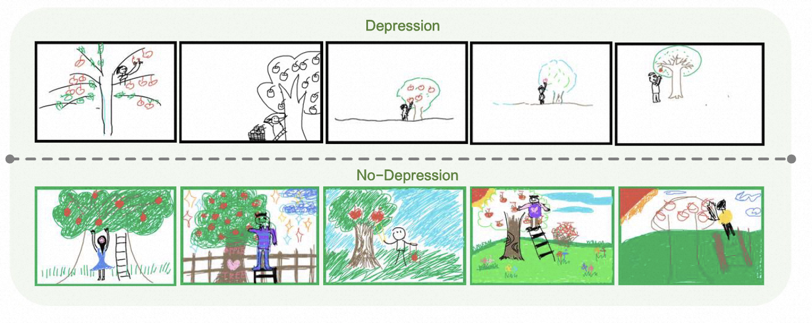
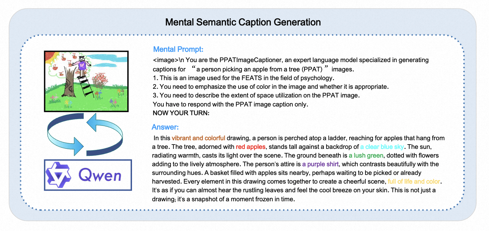

# VS-LLM: Visual-Semantic Depression Assessment Based on LLM for Drawing Projection Test

<p align="center">
  
</p>

<p align="center">
        📑 <a href="https://link.springer.com/chapter/10.1007/978-981-97-8692-3_17">Paper</a> &nbsp&nbsp 
        <!-- | &nbsp&nbsp 🌐 <a href="https://amap-ml.github.io/VMBench-Website/">Website</a> -->
</p>

# 🔥 Updates
*   \[8/2025\] **VS-LLM** codes & datasets released!
*   \[7/2024\] Paper accepted to PRCV 2024!


# 📣 Overview

<p align="center">
  
</p>

The Drawing Projection Test (DPT) is an essential tool in art therapy, allowing psychologists to assess participants' mental states through their sketches. Specifically, through sketches with the theme of "a person picking an apple from a tree (PPAT)", it can be revealed whether the participants are in mental states such as depression. Compared with scales, the DPT can enrich psychologists' understanding of an individual's mental state. However, the interpretation of the PPAT is laborious and depends on the experience of the psychologists. 
To address this issue, we propose an effective identification method to support psychologists in conducting a large-scale automatic DPT. 
Unlike traditional sketch recognition, DPT more focus on the overall evaluation of the sketches, such as color usage and space utilization. Moreover, PPAT imposes a time limit and prohibits verbal reminders, resulting in low drawing accuracy and a lack of detailed depiction. 
To address these challenges, we propose the following efforts: (1) Providing an experimental environment for automated analysis of PPAT sketches for depression assessment; (2) Offering a **V**isual-**S**emantic depression assessment based on **LLM** (**VS-LLM**) method; (3) Experimental results demonstrate that our method improves by 17.6\% compared to the psychologist assessment method. We anticipate that this work will contribute to the research in mental state assessment based on PPAT sketches' elements recognition. 
<!-- Our datasets and codes are available at: \hyperref[]{https://github.com/wmeiqi/VS-LLM}. -->

# 🧠 Method
<p align="center">
  
</p>

As depicted in Figure, VS-LLM comprises three modules. The Visual Perception Module extracts detailed visual information by decomposing the sketch into sketch sequences; The Mental Semantic Caption Generation Module generates an overall caption for the Text Encoder to obtain global information on the sketch; The Mental Classification Module integrates visual and semantic features for classification.

# 📚 PPAT Dataset

## Sketches

The PPAT dataset contains 690 sketches, some examples of which are shown in the following figure.
<p align="center">
  
</p>
<p align="center">
  Figure 2: The examples of PPAT Sketches.
</p

## Captions
We designed mental prompts and input them into Qwen-VL to obtain the psychological semantic description of the sketch.
<p align="center">
  
</p>
<p align="center">
  Figure 3: The examples of PPAT Sketch Captions.
</p>

## Statistics
<div align="center">

| Metric | Type | Value |
|:------:|:----:|:-----:|
| **Age** | 0-20 | 123/690 |
|  | 20-40 | 531/690 |
|  | 40-60 | 32/690 |
|  | >60 | 4/690 |
| **Gender** | Male | 302/690 |
|  | Female | 388/690 |
|  | Neutral | 0/690 |
| **Mental State** | Depression | 117/690 |
|  | No Depression | 573/690 |

Table1: PPAT Dataset Statics.

</div>

# 📊 Evaluation Results
Experimental Results of Psychologist Assessment and AI-Automated 
Assessment on PPAT Dataset. The input for the psychologist assessment method consists of scores from the 14 dimensions of FEATS. The input for the AI automated assessment method is the PPAT sketch. Note that we only calculate the number of trainable parameters of the model.

<div align="center">

| Method | Model | Acc(%) | Params(M) | FLOPs |
|--------|-------|:------:|:---------:|:-----:|
| **Psychologist Assessment** | Random Forest | **70.2** | - | - |
|  | SVM | 57.3 | - | - |
|  | Logistic Regression | 56.4 | - | - |
|  | MLP | 64.3 | - | - |
| **AI Automatic Assessment** | Resnet18 | 83.3 | 11.18 | 4.11 |
|  | Sketch-a-net | 85.7 | 8.41 | 1.51 |
|  | **VS-LLM (Ours)** | **87.8** | 8.87 | 1.51 |

Table2
</div>


# 🔨 Installation

We will provide the installation instructions for VS-LLM.
<!-- ## Create Environment

```shell
git clone https://github.com/Ran0618/VMBench.git
cd VMBench

# create conda environment
conda create -n VMBench python=3.10
pip install --upgrade setuptools
pip install torch==2.5.1 torchvision==0.20.1

# Install Grounded-Segment-Anything module
cd Grounded-Segment-Anything
python -m pip install -e segment_anything
pip install --no-build-isolation -e GroundingDINO
pip install -r requirements.txt

# Install Groudned-SAM-2 module
cd ../Grounded-SAM-2
pip install -e .

# Install MMPose toolkit
pip install -U openmim
mim install mmengine
mim install "mmcv==2.1.0"
mim install "mmdet==3.2.0"
cd ../mmpose
pip install -r requirements.txt
pip install -v -e .

# Install Q-Align module
cd ../Q-Align
pip install -e .

# Install VideoMAEv2 module
cd ../VideoMAEv2
pip install -r requirements.txt

cd ..
pip install -r requirements.txt
```

## Download Checkpoints
Place the pre-trained checkpoint files in the `.cache` directory.
You can download our model's checkpoints are from our [HuggingFace repository 🤗](https://huggingface.co/GD-ML/VMBench).
You also need to download the checkpoints for [Q-Align 🤗](https://huggingface.co/q-future/one-align) and [BERT 🤗](https://huggingface.co/google-bert/bert-base-uncased) from their respective HuggingFace repositories

```shell
mkdir .cache

huggingface-cli download GD-ML/VMBench --local-dir .cache/
huggingface-cli download q-future/one-align --local-dir .cache/
huggingface-cli download google-bert/bert-base-uncased --local-dir .cache/
```
Please organize the pretrained models in this structure:
```shell
VMBench/.cache
├── google-bert
│   └── bert-base-uncased
│       ├── LICENSE
│        ......
├── groundingdino_swinb_cogcoor.pth
├── q-future
│   └── one-align
│       ├── README.md
│       ......
├── sam2.1_hiera_large.pt
├── sam_vit_h_4b8939.pth
├── scaled_offline.pth
└── vit_g_vmbench.pt
```

# 🔧Usage

## Videos Preparation

Generate videos of your model using the 1050 prompts provided in `prompts/prompts.txt` or `prompts/prompts.json` and organize them in the following structure:

```shell
VMBench/eval_results/videos
├── 0001.mp4
├── 0002.mp4
...
└── 1050.mp4
```

**Note:** Ensure that you maintain the correspondence between prompts and video sequence numbers. The index for each prompt can be found in the `prompts/prompts.json` file.

You can follow us `sample_video_demo.py` to generate videos. Or you can put the results video named index into your own folder.
    

## Evaluation on the VMBench

### Running the Evaluation Pipeline
To evaluate generated videos using the VMBench, run the following command:

```shell
bash evaluate.sh your_videos_folder
```

The evaluation results for each video will be saved in the `./eval_results/${current_time}/results.json`. Scores for each dimension will be saved as `./eval_results/${current_time}/scores.csv`.

### Evaluation Efficiency

We conducted a test using the following configuration:

- **Model**: CogVideoX-5B
- **Number of Videos**: 1,050
- **Frames per Video**: 49
- **Frame Rate**: 8 FPS

Here are the time measurements for each evaluation metric:

| Metric | Time Taken |
|--------|------------|
| PAS (Perceptible Amplitude Score) | 45 minutes |
| OIS (Object Integrity Score) | 30 minutes |
| TCS (Temporal Coherence Score) | 2 hours |
| MSS (Motion Smoothness Score) | 2.5 hours |
| CAS (Commonsense Adherence Score) | 1 hour |

**Total Evaluation Time**: 6 hours and 45 minutes -->

# ❤️Acknowledgement
We would like to express our gratitude to the following open-source repositories that our work is based on: [Sketch-A-Net](https://github.com/dasayan05/sketchanet-quickdraw), [Qwe2.5-VL](https://github.com/QwenLM/Qwen2.5-VL). Their contributions have been invaluable to this project.

# 📜License
The VMBench is licensed under [Apache-2.0 license](http://www.apache.org/licenses/LICENSE-2.0). You are free to use our codes for research purpose.

# ✏️Citation
If you find our repo useful for your research, please consider citing our paper:
  ```bibtex
@inproceedings{wu2024vs,
  title={VS-LLM: Visual-Semantic Depression Assessment Based on LLM for Drawing Projection Test},
  author={Wu, Meiqi and Kang, Yaxuan and Li, Xuchen and Hu, Shiyu and Chen, Xiaotang and Kang, Yunfeng and Wang, Weiqiang and Huang, Kaiqi},
  booktitle={Chinese Conference on Pattern Recognition and Computer Vision (PRCV)},
  pages={232--246},
  year={2024},
  organization={Springer}
}
   ```
